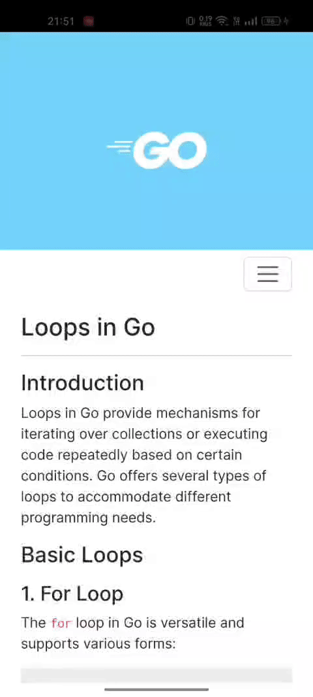

# MyGOBook

Welcome to MyGOBook, a Progressive Web App (PWA) designed to provide study materials, including notes on Golang. This app offers a clean user interface and offline capabilities, making it easier for you to access study resources anytime, anywhere.

  

## Features

- **Offline Access**: MyGOBook allows you to access study materials even when you are offline.
- **Responsive Design**: Optimized for both desktop and mobile devices.
- **Easy Navigation**: User-friendly interface with a well-organized structure.
- **Customizable Themes**: Choose between light and dark themes based on your preference.
- **Search Functionality**: Quickly find the notes or topics you are looking for.

## Getting Started

You can access the app directly via the following URL:
[https://mygobook2024.web.app/](https://mygobook2024.web.app/)

### Installation

MyGOBook is a PWA, which means you can install it on your device for a native app-like experience. 

#### On Desktop:
1. Open the app in your web browser.
2. Click on the install button in the address bar or the install prompt.
3. Follow the instructions to add the app to your desktop.

#### On Mobile:
1. Open the app in your mobile browser (preferably Chrome for Android).
2. Tap on the menu button (three dots) in the top-right corner.
3. Select "Add to Home screen" and follow the instructions.

